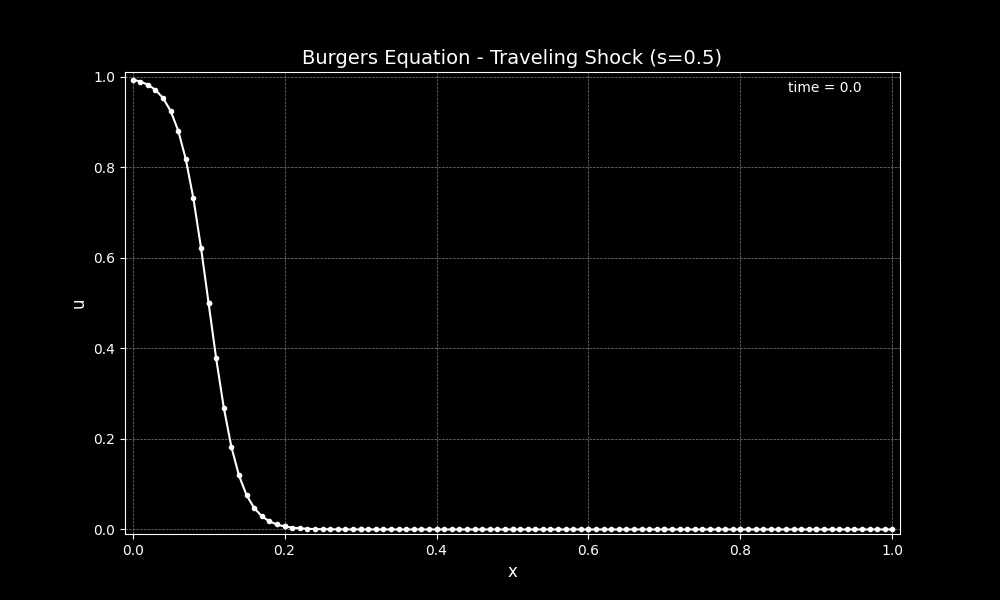
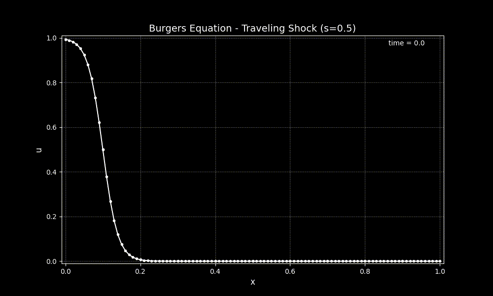

# Traveling Shockwave Tutorial
This tutorial will walk you through using an example program that uses the `SELF_Burgers1D` class to run a simulation with the viscous Burger's equation in 1-D. 

## Problem statement
In this example, we are solving the viscous Burger's equation, given by

\begin{equation}
u_t + \left( \frac{u^2}{2} \right)_x = \nu u_{xx}
\end{equation}

The physical domain is defined by $x \in [0, 1]$. The initial and boundary conditions are set using an exact solution,

\begin{equation}
u(x,t) = s - 0.5(u_l-u_r) \tanh\left( \frac{(x - st - x_0)(u_l-u_r)}{4\nu} \right)
\end{equation}

where $s = \frac{u_l + u_r}{2}$ is the shock speed. For the example problem, we let set the following parameters

* $u_l = -1.0$
* $u_r = 1.0$
* $\nu = 0.01$
* $x_0 = 0.1$

When $t=0$, this defines a shock with characteristic length-scale $L = \frac{\nu}{U} = \frac{0.01}{1} = 0.01$ centered at $x=x_0=0.1$. The difference in the solution between upstream and downstream of the shock is $\Delta u = u_l - u_r = 1$

<figure markdown>
{ align=left }
  <figcaption>Initial condition for a viscous traveling shock</figcaption>
</figure>

<figure markdown>
{ align=left }
  <figcaption>A video of the evolution of the shockwave as it travels to the right at a speed of 0.5</figcaption>
</figure>