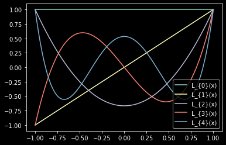
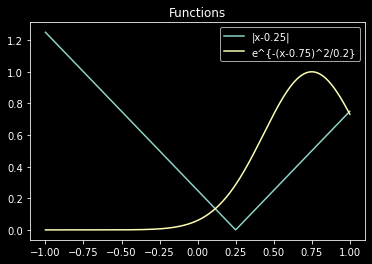
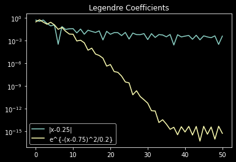

# Spectral Approximations

## Motivation
In spectral element methods, functions are approximated in a "nodal" form, where the function is replaced by an interpolant

$$
  f \approx I^N(f) \equiv \sum_{i=0}^N f_i l_i(x)
$$

where the $\{f_i\}_{i=0}^N$ are the nodal values of the function at interpolation knots $x_i$, and $l_i(x)$ are interpolants that typically satisfy the Kronecker-delta property $l_i(x_j) = \delta_{i,j}$. For polynomial based spectral element methods, the $l_i(x)$ are typically the [Lagrange interpolating polynomials](https://mathworld.wolfram.com/LagrangeInterpolatingPolynomial.html).

The error in the interpolation is defined as the difference between the interpolant and the function

$$
  \epsilon_I = || f - I^N(f) || 
$$

It turns out that the size of this error and the convergence rate depends on the smoothness of the function $f$ and where the interpolation knots are located. In order to show this, we actually need to take a step back and talk about polynomial basis functions and projections.

## Modal Approximations
When discussing projections, we need to first lay down some ground rules that restrict our attention to only certain types of functions. Here, we consider only functions that are square integrable over the domain $[-1,1]$. This criteria means that

$$
\int_{-1}^{1} f^2 \hspace{1mm} dx < \infty
$$

and this space is often denoted as $L^2([-1,1])$. 

A **basis** for $L^2([-1,1])$ is a set of functions that can be linearly combined together to represent any other function in $L^2([-1,1])$. If you've taken linear algebra before, basis functions here are analogous to basis vectors in linear algebra. What this means is that, if I have a set of basis functions $\{\phi_i(x)\}_{i=0}^{\infty}$, I can write any square-integrable function as

$$
  f = \sum_{i=0}^\infty \hat{f}_i \phi_i(x); \hspace{5mm} f, \phi_i \in L^2([-1,1])
$$

where the $\hat{f}_i$ are the **modal** coefficients of $f$. 

In practice this can be useful; we have the ability to represent an unknown function $f$ by a linear combination of functions we know more about. By representing the function by a linear combination of basis functions $\phi$ that we know the properties of, we can gain an understanding about the observations we've made; in our case, we exploit this knowledge to develop numerical methods, where the function $f$ is an unknown solution to an ordinary or partial differential equation.

## Polynomial Spectral Methods
Polynomial based spectral elements use Jacobi Polynomials, which are generated from a special class of Sturm-Liouville problem. You can read more about the Sturm-Liouville problem that is used to generate polynomial basis in Chapter 1, Section 1.8 in ["Implementing Spectral Methods for Partial Differential Equations" by D.A. Kopriva](https://link.springer.com/book/10.1007/978-90-481-2261-5).

Jacobi polynomials come with an orthogonality property : 

$$
< P_i, P_j> = \int_{-1}^{1} P_i(x) P_j(x) w(x) \hspace{1mm} dx = ||P_j||^2 \delta_{i,j}
$$

where $<u,v>$ denotes an **inner product** of $u$ and $v$, $w(x)$ is a weight function that is determined from the Sturm-Liouville problem that generates the Jacobi polynomials $P_i(x)$, and $||P_j||^2 = <P_j,P_j>$ is the squared norm of the $j^{th}$ Jacobi polynomial.

Most often Legendre or Chebyshev polynomials, which are types of Jacobi Polynomials, are used. In this discussion, we focus on Legendre polynomials, which have a constant weight function $w(x) = 1$. Legendre polynomials satisfy the three term recursion

$$
L_{k+1}(x) = \frac{2k+1}{k+1} x L_k(x) - \frac{k}{k+1}L_{k-1}(x)
$$

with $L_0(x) = 1$ and $L_1(x) = x$. The first few Legendre polynomials are shown below.

{ align=center }

The orthogonality property for Legendre polynomials is 

$$
< L_i, L_j> = \int_{-1}^{1} L_i(x) L_j(x) \hspace{1mm} dx = ||L_j||^2 \delta_{i,j}
$$

This property is useful in that it simplifies the determination of the modal coefficients of a function.

$$
  <f,L_j> = \sum_{i=0}^\infty \hat{f}_i <L_i(x),L_j(x)> = \hat{f}_j ||L_j||^2
$$

$$
  \rightarrow \hat{f}_j = \frac{<f,L_j>}{||L_j||^2}
$$

where $||L_j||^2 = <L_j,L_j>$ is the squared norm of the $j^{th}$ Legendre polynomial.

In the example below, we show a few functions with varying degree of smoothness and calculate the first 50 Legendre modal coefficients.

{ align=center } 

In this example, we compare two functions :

* $f(x) = |x - \frac{1}{4}|$
* $f(x) = e^{-\frac{(x-\frac{3}{4})^2}{0.2}}$

The first function has a discontinuity in its derivative at $x=\frac{1}{4}$, while the Guassian is "complete" (all derivatives exist and are continuous). Notice the rate of decay of the Legendre coefficients (below) for the absolute value function compared to the Gaussian. 

The Gaussian's coefficients decay exponentially fast, while the absolute value function decays rather slowly.

{ align=center }

## Truncation

To develop a practical numerical method, we need to be able to work with a finite series representation of a function; we cannot sum to infinity over all Legendre polynomials in practice. Thus, we can split the infinite sum into a finite sum and everything else

$$
  f = \underline{\sum_{i=0}^N \hat{f}_i L_i(x)} + \sum_{i=N+1}^\infty \hat{f}_i L_i(x)
$$

The underlined term is called the **projection** of $f$ onto the space of polynomials of degree $N$. Often, this is written

$$
 P^N(f) \equiv \sum_{i=0}^N \hat{f}_i L_i(x)
$$

The (squared norm) error associated with truncation can then be written

$$
\epsilon_P = || f - P^N(f) ||^2 = \sum_{i=N+1}^\infty |\hat{f}_i|^2 || L_i(x) ||^2 
$$

which shows that the error depends on the magnitude of the modal coefficients.

 In the examples above, you can see the modal coefficients for a few functions, some that are "smooth" and some that are not, like the heaviside step function. Notice that smooth functions have coefficients that decay rapidly, while functions that have discontinuities have a slower decay rate. Because of this, we say that a spectral approximation has an error convergence rate (as a function of $N$) that depends on the smoothness of the function. Complete functions have errors that decay exponentially fast. Functions that have a discontinuity in their $h^{th}$ derivative have an error convergence rate that is $\mathcal{O}(N^h)$.

## Nodal Approximations

So far, we've looked at **modal** approximations using the projection onto the Legendre polynomial basis. In most applications of numerical methods, we are more interested in knowing how a function varies with space and time. When using modal approximations, the degrees of freedom in the method are the modal coefficients; the nodal values of the function are then diagnosed using the formula for the projection of the function.

Alternatively, you could use an interpolant instead where the unknowns are taken to be values of the function at specific locations in space. To introduce a nodal approximation and discuss the error incurred in such a representation, we need to discuss quadrature rules for discrete integration.

### Quadrature
A quadrature rule is a formula that is used to approximate an integral as a weighted sum

$$
\int_a^b f(x) dx = \sum_{i=0}^N f(x_i) \omega_i + \epsilon_Q
$$

where the $x_i$ are the quadrature knots, the $\{\omega_i\}_{i=0}^N$ are the quadrature weights, and $\epsilon_Q$ is the error.

In spectral methods, we choose the quadrature so that we preserve the orthogonality condition between the underlying basis. Mathematically, we want to find $\{x_i;\omega_i\}_{i=0}^N$ so that

$$
  \sum_{k=0}^N L_i(x_k)L_j(x_k) \omega_k = \int_{-1}^{1}L_i(x_k)L_j(x_k) dx
$$

over the widest possible range of $i$ and $j$. The derivation of the solution to this problem can be found in Chapter 1, Section 1.11 of ["Implementing Spectral Methods for Partial Differential Equations" by D.A. Kopriva](https://link.springer.com/book/10.1007/978-90-481-2261-5). The end result is that the **Legendre Gauss** qaudrature rule is necessary to maintain discrete orthogonality, where

$$
  x_k = \text{zeros of } L_{N+1}(x)
$$

$$
  \omega_k = \frac{2}{(1-x_k^2)[L'_{N+1}(x_j)]^2}
$$

Legendre Gauss Quadrature is exact for polynomials of degree $2N+1$ or less. 

Another popular choice is the **Legendre Gauss-Lobatto** Quadrature, since the quadrature knots include the domain end-points 

$$
  x_k = \pm 1, \text{zeros of } L'_{N}(x)
$$

$$
  \omega_k = \frac{2}{N(N+1)[L_{N}(x_j)]^2}
$$

Legendre Gauss-Lobatto Quadrature, however, is less accurate and is exact for polynomials of degree $2N-1$ or less.

With the quadrature rule, we can now define the discrete inner product

$$
<u,v>_N = \sum_{k=0}^N u(x_k) v(x_k) \omega_k
$$

where the $x_k$ and $\omega_k$ are taken as a Legendre-Gauss type quadrature rule.

## Interpolation & Aliasing

We now define the interpolant 

\begin{equation}
  I_N(f) = \sum_{i=0}^N \tilde{f}_i L_i(x)
\end{equation}

where the $L_k$ are the Legendre polynomials. The interpolant satisfies the constraint 

\begin{equation}
I_N(f)(x_k) = \sum_{i=0}^N \tilde{f}_i L_i(x_k) = f(x_k)
\end{equation}

The $\tilde{f}_k$ are the discrete coefficients; they are not the modal coefficients $\hat{f}_k$ that we derived previously.

To find the discrete coefficients, we can appeal to our quadrature rules that maintain discrete orthogonality,
\begin{equation}
<I_N(f),L_j>_N = \sum_{i=0}^N \tilde{f}_i <L_i, L_j>_N, \hspace{5mm} j=0,1,2,...,N
\end{equation}

Using the discrete orthogonality condition, we have that

\begin{equation}
\tilde{f}_j = \frac{<I_N(f),L_j>_N}{||L_j||^2_N} = \frac{1}{||L_j||^2_N}\sum_{k=0}^N f(x_k) L_j(x_k) \omega_k
\end{equation}

Likewise, the nodal values of the interpolant can be computed
\begin{equation}
f(x_j) = \sum_{i=0}^N \tilde{f}_i L_i(x_j)
\end{equation}

These two equations are the "Discrete Polynomial Transform Pair"; much like the Discrete Fourier and Inverse Fourier Transforms they allow you to transition between the discrete modal coefficients and nodal values.

To understand the errors involved, we can replace $f(x_j)$ in the equation for the modal coefficients by its complete modal expansion

\begin{align}
\tilde{f}_j &= \frac{1}{||L_j||^2_N}\sum_{k=0}^N f(x_k) L_j(x_k) \omega_k \\
&= \frac{1}{||L_j||^2_N}\sum_{k=0}^N \left[ \sum_{i=0}^\infty \hat{f}_i L_i(x_k)\right] L_j(x_k) \omega_k \\
&= \frac{1}{||L_j||^2_N}\sum_{k=0}^N \left[ \sum_{i=0}^N \hat{f}_i L_i(x_k)\right] L_j(x_k) \omega_k + \frac{1}{||L_j||^2_N}\sum_{k=0}^N \left[ \sum_{i=N+1}^\infty \hat{f}_i L_i(x_k)\right] L_j(x_k) \omega_k\\
&= \hat{f}_k + \frac{1}{||L_j||^2_N}\sum_{k=0}^N \left[ \sum_{i=N+1}^\infty \hat{f}_i L_i(x_k)\right] L_j(x_k) \omega_k\\
&= \hat{f}_k + \underline{\frac{1}{||L_j||^2_N} \sum_{i=N+1}^\infty \hat{f}_i <L_i,L_j>_N}\\
\end{align}

The underlined term is non-zero, because the discrete quadrature is inexact for polynomials with degree greater than $2N+1$ (Gauss). Thus, the discrete coefficients are the modal coefficients plus an additional error, called the **aliasing error**. 

With this result, we can now write the interpolant as 

\begin{align}
I_N(f) &= \sum_{k=0}^N \hat{f}_k L_k + \sum_{k=0}^N \left[ \frac{1}{||L_j||^2_N} \sum_{i=N+1}^\infty \hat{f}_i <L_i,L_j>_N \right]L_k \\
&= P_N(f) + R_N(f)
\end{align}

Thus, the interpolant is the projection operator plus an additional aliasing error. Further, we can estimate the error magnitude

\begin{align}
 || f - I_N(f) ||^2 &= || ( f-P_N(f) ) - R_N(f) ||^2 \\
 &\leq || ( f-P_N(f) )||^2 + || R_N(f) ||^2
\end{align}

Keep in mind that the aliasing error size also depends on the magnitude of the modal coefficients. Using the same arguments we made before for the projection error, you can see that the aliasing error is also spectrally accurate. For detailed proofs that relate the Legendre coefficient magnitude decay rate to function smoothness can be found in [Spectral Methods Fundamentals in Single Domains](https://link.springer.com/book/10.1007/978-3-540-30726-6).
