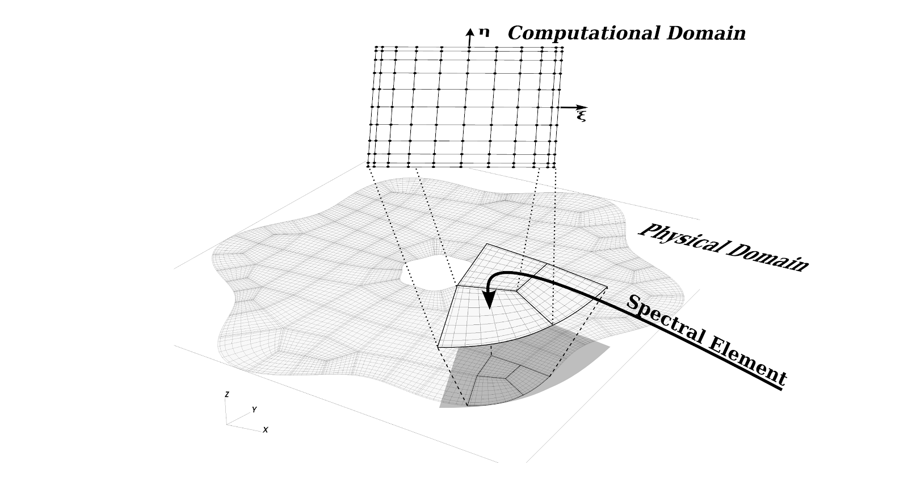

## Overview of Mesh generation
<figure markdown="span">
  { width=600 }
  <figcaption></figcaption>
</figure>

Every model in SELF needs to be associated with an interpolant, a mesh, and geometry. SELF uses a static unstructured mesh of elements. Within each element is a structured grid where the points in computational space are defined at Gauss-type quadrature points (Legendre Gauss or Legendre Gauss Lobatto). 

The typical workflow for instantiating a model is to first create the mesh and the interpolant. The mesh defines the bounding vertices for each element, the relatioEvery model in SELF needs to be associated with an interpolant, a mesh, and geometry. 
nship between the vertex IDs and the elements, the relationship between the bounding edges(2-D)/faces(3-D) and the neighboring elements, material identifiers for each element, and boundary conditions for physical model boundaries. The interpolant specifies the degree of the Lagrange interpolating polynomial and the interpolation knots. For spectral accuracy, the interpolation knots are equal to the quadrature points and are either `GAUSS` or `GAUSS_LOBATTO`. This in turn determines weights used in the interpolation and differentiation routines.

From the mesh and interpolant information, we can create the geometry details. The geometry includes the physical positions, covariant basis vectors, contravariant basis vectors, and the jacobian of the coordinate transformation. All of this information is necessary for computing derivatives in mapped coordinates and for computing fluxes between neighboring elements.