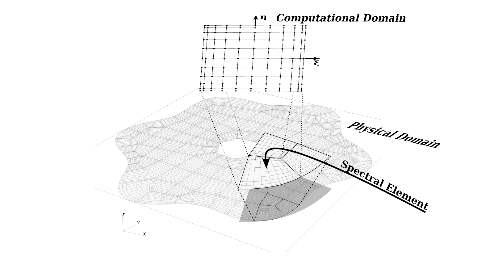

## Overview of Mesh generation
<figure markdown="span">
  { width=600 }
  <figcaption></figcaption>
</figure>

Every model in SELF needs to be associated with an interpolant, a mesh, and geometry. SELF uses a static unstructured mesh of elements. Within each element is a structured grid where the points in computational space are defined at Gauss-type quadrature points (Legendre Gauss or Legendre Gauss Lobatto). 

The typical workflow for instantiating a model is to first create the mesh and the interpolant. The mesh defines the bounding vertices for each element, the relationship between the vertex IDs and the elements, the relationship between the bounding edges(2-D)/faces(3-D) and the neighboring elements, material identifiers for each element, and boundary conditions for physical model boundaries. The interpolant specifies the degree of the Lagrange interpolating polynomial and the interpolation knots. For spectral accuracy, the interpolation knots are equal to the quadrature points and are either `GAUSS` or `GAUSS_LOBATTO`. This in turn determines weights used in the interpolation and differentiation routines.

From the mesh and interpolant information, we can create the geometry details. The geometry includes the physical positions, covariant basis vectors, contravariant basis vectors, and the jacobian of the coordinate transformation. All of this information is necessary for computing derivatives in mapped coordinates and for computing fluxes between neighboring elements.

## Importing HOHQMesh meshes (ISM and ISM-MM)

SELF can read [HOHQMesh](https://github.com/trixi-framework/HOHQMesh) text mesh files in the ISM and ISM-MM formats in both 2-D (quadrilateral elements) and 3-D (hexahedral elements, produced by HOHQMesh's extrusion/sweep pipeline):

```fortran
type(Mesh2D) :: mesh2d
type(Mesh3D) :: mesh3d

call mesh2d%Read_HOHQMesh("path/to/quad.mesh")
call mesh3d%Read_HOHQMesh("path/to/hex.mesh")
```

The variant is detected automatically. ISM-MM files associate a material-name string with every element; the reader collects the names into `mesh%materialNames(1:mesh%nMaterials)` and tags each element with an index into that table in `mesh%elemMaterial(1:mesh%nElem)`. Plain ISM files (and all other mesh constructors and readers) leave a single material named `"default"`. Note that 2-D files carry an `ISM-MM` header line, while 3-D files have no header — the material string on each element's corner-node line is the only difference from plain ISM.

Boundary-condition names from the mesh file are collected into `mesh%BCNames`, and `mesh%sideInfo(5,:,:)` stores the 1-based index into that table for each physical boundary side (0 for interior sides). Curved boundary information is read at Chebyshev-Gauss-Lobatto points and element interiors are filled by transfinite interpolation, so the resulting mesh has `mesh%quadrature = CHEBYSHEV_GAUSS_LOBATTO`.

Multi-material example meshes are provided in `share/mesh/MultiMaterial2D` (bone-and-marrow cross section) and `share/mesh/MultiMaterial3D` (a two-material extruded "insulated wire" O-grid, along with the script that generates it).