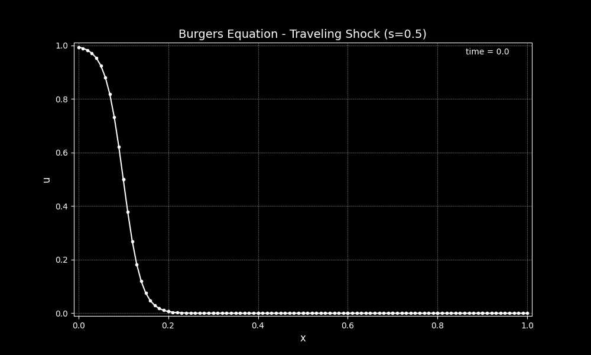
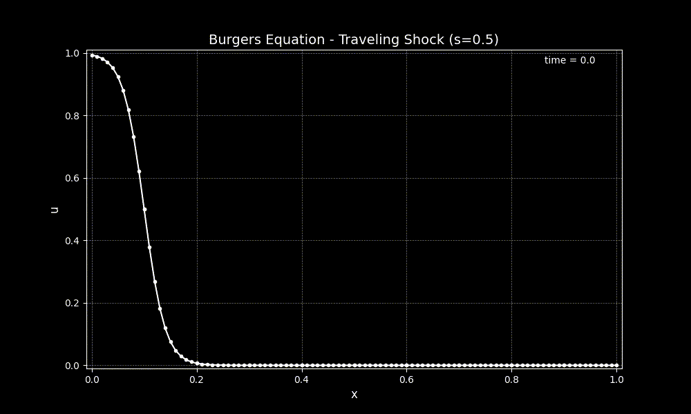

# Traveling Shockwave Tutorial
This tutorial will walk you through using an example program that uses the `SELF_Burgers1D` class to run a simulation with the viscous Burger's equation in 1-D. 

## Problem statement
In this example, we are solving the viscous Burger's equation, given by

\begin{equation}
u_t + \left( \frac{u^2}{2} \right)_x = \nu u_{xx}
\end{equation}

The physical domain is defined by $x \in [0, 1]$. The initial and boundary conditions are set using an exact solution,

\begin{equation}
u(x,t) = s - 0.5(u_l-u_r) \tanh\left( \frac{(x - st - x_0)(u_l-u_r)}{4\nu} \right)
\end{equation}

where $s = \frac{u_l + u_r}{2}$ is the shock speed. For the example problem, we let set the following parameters

* $u_l = 1.0$
* $u_r = 0.0$
* $\nu = 0.01$
* $x_0 = 0.1$

When $t=0$, this defines a shock with characteristic length-scale $L = \frac{\nu}{U} = \frac{0.01}{1} = 0.01$ centered at $x=x_0=0.1$. The difference in the solution between upstream and downstream of the shock is $\Delta u = u_l - u_r = 1$ and the shock travels at a speed of $s=\frac{1}{2}$

<figure markdown>
{ align=left }
  <figcaption>Initial condition for a viscous traveling shock</figcaption>
</figure>

<figure markdown>
{ align=left }
  <figcaption>A video of the evolution of the shockwave as it travels to the right at a speed of 0.5</figcaption>
</figure>

## How we implement this
You can find the example file for this demo in the `examples/burgers1d_shock.f90` file. This file defines the `burgers1d_shock_model` module in addition to a program that runs the traveling shock simulation. 

The `burgers1d_shock_model` module defines the `burgers1d_shock` class, which is a type extension of the `burgers1d` class that is provided by SELF. We make this type extension so that we can 
* add parameters for the left and right state of the shock wave,
* add a parameter for the initial center position of the shock, and
* override the `hbc1d_Prescribed` and `pbc1d_Prescribed` type-bound procedures.

This last component allows us to set the boundary conditions as the exact solution for the shock problem. The `hbc1d_Prescribed` boundary condition is used to set the external solution state on the boundaries; this external state is used in the *hyperbolic* fluxes. The `pbc1d_Prescribed` boundary condition is used to set the external state for the solution gradient on the boundaries; this is often used for the *parabolic* fluxes.


For the boundary condition for the solution is set to
\begin{equation}
u(x,t) = s - 0.5(u_l-u_r) \tanh\left( \frac{(x - st - x_0)(u_l-u_r)}{4\nu} \right)
\end{equation}

and the boundary condition for the solution gradient is set to 

For the boundary condition for the solution
\begin{equation}
\frac{∂ u}{∂ x}(x,t) = \frac{0.5 (u_l-u_r)^2}{4\nu}  \left[sech\left( \frac{(x - st - x_0)(u_l-u_r)}{4\nu} \right)\right]^2
\end{equation}


All of this is summarized in the `burgers1d_shock_model` module

```fortran
type, extends(burgers1D) :: burgers1d_shock
  real(prec) :: ul = 1.0_prec
  real(prec) :: ur = 0.0_prec
  real(prec) :: x0 = 0.1_prec

  contains

  procedure :: hbc1d_Prescribed => hbc1d_Prescribed_burgers1d_shock ! override for the hyperbolic boundary conditions
  procedure :: pbc1d_Prescribed => pbc1d_Prescribed_burgers1d_shock ! override for the parabolic boundary conditions

endtype burgers1d_shock

contains

pure function hbc1d_Prescribed_burgers1d_shock(this,x,t) result(exts)
class(burgers1d_shock),intent(in) :: this
real(prec),intent(in) :: x
real(prec),intent(in) :: t
real(prec) :: exts(1:this%nvar)
! Local
real(prec) :: jump, s

  jump = this%ul - this%ur
  s = 0.5_prec*(this%ul + this%ur)
  exts(1) = s - 0.5_prec*tanh( (x-s*t-this%x0)*jump/(4.0_prec*this%nu) )

endfunction hbc1d_Prescribed_burgers1d_shock

pure function pbc1d_Prescribed_burgers1d_shock(this,x,t) result(extDsdx)
class(burgers1d_shock),intent(in) :: this
real(prec),intent(in) :: x
real(prec),intent(in) :: t
real(prec) :: extDsdx(1:this%nvar)
! Local
real(prec) :: jump, s, r, drdx

  jump = this%ul - this%ur
  s = 0.5_prec*(this%ul + this%ur)
  r = (x-s*t-this%x0)*jump/(4.0_prec*this%nu)
  drdx = jump/(4.0_prec*this%nu)
  extDsdx(1) = -0.5_prec*drdx*( sech( r ) )**2

endfunction pbc1d_Prescribed_burgers1d_shock

pure real(prec) function sech(x) result(fx)
real(prec),intent(in) :: x
fx = 2.0_prec/(exp(x)+exp(-x))
endfunction
```

The main program for this example walks through standard procedures for running any simulation using SELF.

First, the interpolant, mesh, and geometry are created. Here, we define the mesh using the `UniformBlockMesh` to create a mesh on a domain $ x ∈ [0,1] $. The left and right boundary conditions are set to the prescribed boundary condition (`SELF_BC_PRESCRIBED`). Then we create the interpolant using Legendre-Gauss quadrature. The geometry is then initialized, binding the interpolant to the geometry, and the metric terms are generated from the mesh information.

```fortran
call mesh%UniformBlockMesh(nGeo=1, &
                               nElem=nelem, &
                               x=(/0.0_prec,1.0_prec/))

! Set the left and right boundary conditions to prescribed                               
call mesh%ResetBoundaryConditionType(SELF_BC_PRESCRIBED,SELF_BC_PRESCRIBED)

! Create an interpolant
call interp%Init(N=controlDegree, &
                  controlNodeType=GAUSS, &
                  M=targetDegree, &
                  targetNodeType=UNIFORM)

! Generate geometry (metric terms) from the mesh elements
call geometry%Init(interp,mesh%nElem)
call geometry%GenerateFromMesh(mesh)
```

Following this, the `burgers1d_shock` model is initialized, associating the interpolant, geometry, and mesh to the model. We enable gradient calculations, so that we can calculate diffusive fluxes. We then set the initial conditions using the exact solution to the traveling shock problem.


```fortran

! Initialize the model
call modelobj%Init(nvar,mesh,geometry)
modelobj%gradient_enabled = .true.
!Set the diffusivity
modelobj%nu = nu

! Set the initial condition
jump = modelobj%ul - modelobj%ur
s = 0.5_prec*(modelobj%ul + modelobj%ur)
modelobj%solution%interior(:,:,1) = s - 0.5_prec*tanh( &
  (geometry%x%interior(:,:,1)-modelobj%x0)*jump/(4.0_prec*modelobj%nu) )
```

Following this, we configure the time integrator and forward step the model. During forward stepping, both tecplot curve files and SELF's HDF5 pickup files are written at every `ioInterval`.

```fortran
call modelobj%SetTimeIntegrator(integrator)

! forward step the model to `endtime` using a time step
! of `dt` and outputing model data every `iointerval`
call modelobj%ForwardStep(endtime,dt,iointerval)
```

At the end of the program, all of the objects are freed from memory. It's important to start with the model object and end with the interpolant so that the geometry, mesh, and interpolant can be cleanly dissociated.

```fortran
call modelobj%free()
call mesh%free()
call geometry%free()
call interp%free()
```


