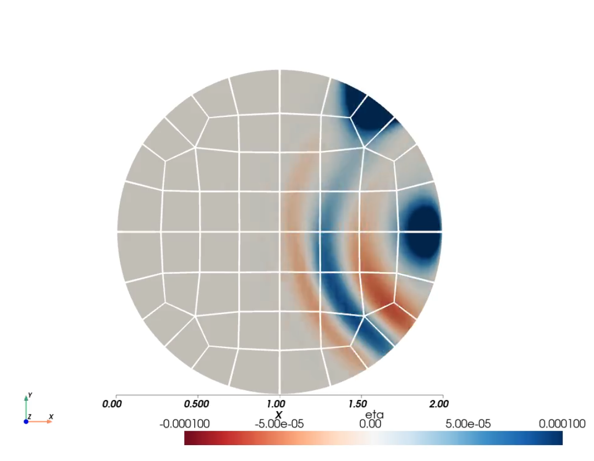

# Kelvin waves
This experiment is designed to demonstrate the preferred direction of phase propagation exhibited by Kelvin Waves. We use a circular domain in a rotating reference frame with a no-normal-flow boundary condition and an initial disturbance in the free-surface height placed on the domain boundary. The free surface height disturbance adjusts into geostrophic balance and in the process radiates gravity waves and a Kelvin wave. This demonstration uses a constant negative value for the coriolis parameter which results in a Kelvin wave that propagates in a clockwise direction, with the domain boundary to the left of the propagation direction.

## Configuration

### Equations

The equations solved are the linear shallow water equations, given by
$$
    u_t - fv = -g \eta_x - C_d u
$$
$$
    v_t + fu = -g \eta_y - C_d v
$$
$$
    \eta_t + (Hu)_x + (Hv)_y = 0
$$

where $\vec{u} =  u \hat{x} + v \hat{y}$ is the barotropic velocity, $g$ is the acceleration of gravity, $C_d$ is the linear drag coefficient, $H$ is a uniform resting fluid depth, and $\eta$ is the deviation of the fluid free surface relative to the resting fluid.

An $f$-plane, in geophysical fluid dynamics, is an approximation that represents the vertical component of the coriolis force using a fixed coriolis frequency. The presence of a constant, non-zero coriolis frequency permits inertial oscillations and Kelvin waves.

For this simulation, we use the following parameters

* $g = 1 m s^{-2}$
* $f_0 = 10 s^{-1}$
* $\beta = 0 m^{-1} s^{-1}$
* $H = 1 m$
* $C_d = 0.25 s^{-1}$

### Domain Discretization
In this problem, the domain is a circle of radius 1m. The model domain meshed using [HOHQMesh](https://github.com/trixi-framework/HOHQMesh) and processed with [HOPr](https://github.com/hopr-framework/hopr). Within each element, the solution is approximated as a Lagrange interpolating polynomial of degree 7, using the Legendre-Gauss quadrature points as interpolating knots. To exchange momentum and mass fluxes between neighboring elements, we use a local upwind (Lax-Friedrich's) Riemann solver.

The physical parameters result in a gravity wave speed of $c= 1 m s^{-1}$. For this mesh, the elements are roughly isotropic with a length scale of about $\Delta x_e \approx 0.2 m$; with a polynomial degree of 7, the smallest resolvable length scale is roughly $\Delta x = \frac{0.2 m}{7^2} \approx 0.004 m$ . 

For time integration, we use Williamson's low storage third order Runge Kutta and we choose a time step size of $\Delta t = 0.0025 s$ so that the CFL number associated with the gravity wave speed is $C_g = \frac{c \Delta t}{\Delta x} \approx 0.61 < 1$.

### Initial Condition and evolution of the model
The initial condition is defined by setting the free surface height to a Gaussian, centered at $(x_c,y_c) = (1,0)$, with a half width of 10 cm and a height of 1 mm.
$$
    \eta(t=0) = 0.001e^{ -( ( (x-1.0)^2 + y^2 )/(0.02) )}
$$

This initial condition is initially out of balance, which causes an erruption of unbalanced flows, including gravity waves, inertia gravity waves, and Kelvin waves. The Kelvin waves are the result of the unbalanced flow up against the no-normal flow wall. Since the coriolis parameter is positive in this demonstration, the Kelvin waves propagate with the boundary (the "coast") on its right. For this circular domain, the Kelvin waves propagate in a counter-clockwise directtion. 

<figure markdown="span">
  { width="500" }
  <figcaption>  Free surface height (<code>eta</code>) shortly after the initial condition. Here, we see a train of gravity waves propagating into the domain and a single peak Kelvin wave traveling along the boundary in a counter-clockwise direction. The initial disturbance is now adjusted into geostrophic balance.
  </figcaption>
</figure>

The release of energy into the unbalanced flows allows the initial disturbance to come into geostrophic balance. As a result, in the vicinity of the initial disturbance, we see a stationary high pressure signal that remains in geostrophic balance.


## Running this example

To run this example, simply execute

```shell
# Set WORKSPACE to the path to the SELF source code
export WORKSPACE=/path/to/SELF
${SELF_ROOT}/examples/linear_shallow_water2d_kelvinwaves
```

This will run the simulation from $t=0$ to $t=1.0$ and write model output at intervals of $Δ t_{io} = 0.05$. Model output can be visualized using `pyself` in python
From the SELF source code directory

```shell
# Assuming you are in the SELF source code directory
pip install . --upgrade
```
You can use the `examples/shallow_water_plot.py` script to plot the model output and generate movie of the free surface height.
